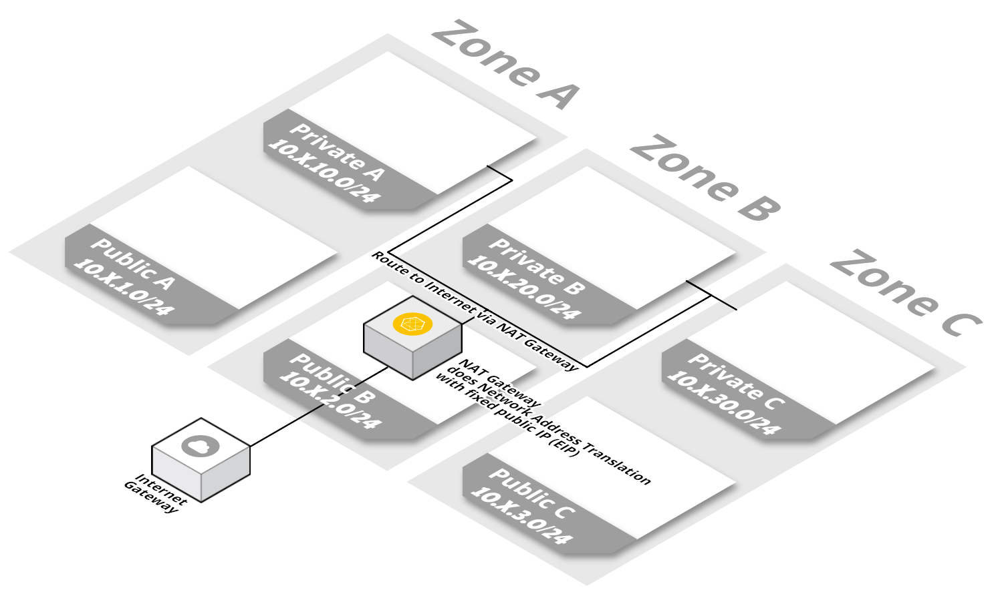
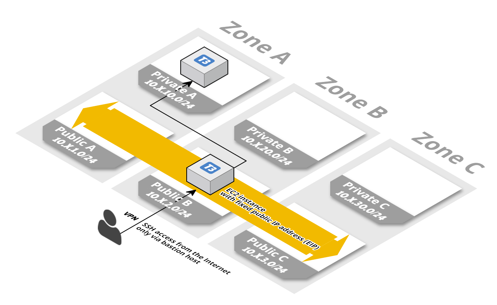
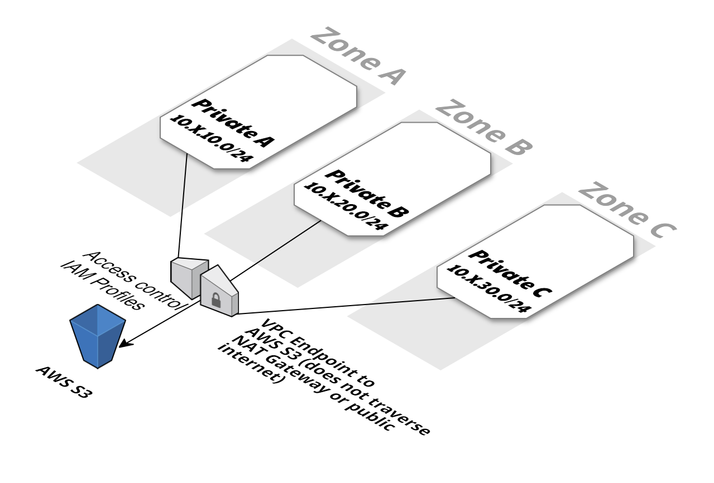

# Creation VPC multi zones sur AWS avec Bastion


Création avec terraform d'un VPC ( Virtual Private Cloud ) sur plusieurs zones de disponibilité ( 3 ).

Mise en place du VPC dans une région, avec: 
* 1 zone Publique ( 3 sous-reseaux, 1 sur chaque zone de disponibilité )
* 1 zone Privée ( 3 sous-reseaux, 1 sur chaque zone de disponibilité )
* 1 passerelle NAT (NAT Gateway AWS) pour la zone Privée




* 1 instance avec un rôle bastion (acces ssh/VPN) en autoscaling (toujours 1 instance de dispo)

L'inclusion d'hôtes bastion dans le VPC permet de se connecter en toute sécurité aux instances Linux sans exposer votre environnement sur Internet. Une fois que vous avez configuré vos hôtes bastion, vous pouvez accéder aux autres instances de votre VPC via des connexions Secure Shell (SSH) sur Linux ou a travers un acces OpenVpn. Les hôtes bastion sont également configurés avec des groupes de sécurité pour fournir un contrôle entrant précis. 

Alimentation du ~/.ssh/authorized_keys du bastion avec les clefs publiques deposées dans un bucket S3.



* 1 endpoint ( point de terminaison) pour acces du service AWS S3 dans le VPC



## Prerequis:

* [Terraform](https://www.terraform.io/downloads.html)
* [aws-cli](https://docs.aws.amazon.com/fr_fr/cli/latest/userguide/installing.html)


## Demarrage:

Definir toute les variables souhaitées dans le fichier variables.tf.


## Lancement:

Lancer le script sh ( reprend l'ensemble des commandes terraform ):
```
./init.sh
```


### Accés SSH

Pour accéder en ssh il suffit de deposer sa clef publique dans le bucket privé S3 ( via aws-cli ):

```
aws s3 cp maclef.pub s3://bastion-keys-bucket/username.pub
```


### Accés VPN
Récupérer la config VPN "admin":

```
scp -i maclef.pem ec2-user@bastion.domain.com:~/admin.tgz .
```

Générer une configuration Utilisateur:

```
/etc/openvpn/Generate-client.sh
```

La configuration utilisateur vpn est alors récupérable sous _/home/ec2-user/username.tgz_

#### Ressources
Pour la partie Bastion SSH:
Fortement inspiré du module terraform community:

https://github.com/terraform-community-modules/tf_aws_bastion_s3_keys

Pictures from:
https://templates.cloudonaut.io