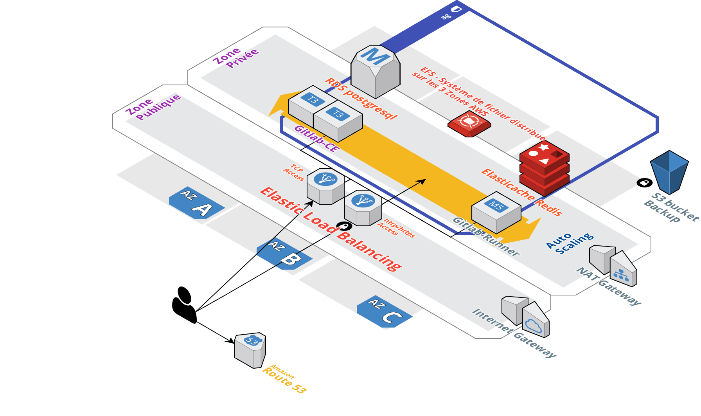

# GitLab haute disponibilité sur AWS

Création d'un Gitlab en haute dispo dans un VPC AWS préalablement créé via:

https://github.com/littlebigcluster/aws-base

La haute disponibilité passera par l'utilisation de certains services managés AWS type:

* EFS (system de fichier via NFS)
* RDS ( base POSTGRESQL)
* Elasticache ( Redis)
* S3 ( sauvegarde)




## Prerequis


* [Terraform](https://www.terraform.io/downloads.html)
* [aws-cli](https://docs.aws.amazon.com/fr_fr/cli/latest/userguide/installing.html)
* [Ansible](https://docs.ansible.com/ansible/latest/installation_guide/intro_installation.html)

Avoir configuré ses credentials AWS:
```
aws configure
```

## Demarrage:

Définir toute les variables souhaitées dans les fichiers :
* variables.template
* variables.tfvars
* group_var/all

Ajouter les mots de passe des variables suivantes dans un fichier .env à la racine:

```
export TF_VAR_ldap_password=xxxxxxxxxxxxxxx
export TF_VAR_postgres_gitlab_pass=xxxxxxxxxxxxxxxxx
export TF_VAR_smtp_password=xxxxxxxxxxxxxxxx
export TF_VAR_gitlab_root_password=xxxxxxxxxxxxxx
export TF_VAR_runner_token=xxxxxxxxxxxxx
```

## Lancement:

Lancer le script sh ( reprend l'ensemble des commandes terraform ):
```
./init.sh
```


## Fonctionnement


* Creation d'une base sur RDS (PostgreSQL engine).
* Creation d'un elasticache service (Redis).
* Creation d'un EFS service disponible dans les 3 zones privées.
* Creation d'une instance EC2 qui fonctionne comme un seed pour le lancement de la configuration.
* Cette instance seed est configurée avec ansible et gitlab omnibus.
* 2 Load Balancer sont créés. ( 1 lb application avec une clef ACM aws associée, et 1 lb network pour les accés ssh au gitlab)
* Une AMI est créée depuis cette instance seed
* Un Autoscaling groupe est créé avec cette AMI
* Un Bucket S3 est reservé à la sauvegarde
* Un backup de gitlab sur S3 est croné toutes les heures
* Une instance Gitlab-ci ( gitlab-runner ) est lancée dans un autoscaling group
* Enregistrement auto du/des runner en mode Autoscaling ( instances ec2 spot ) avec schedule des runners (horaires: entre 7h/19h Lundi au Vendredi) ...

## Ressources AWS utilisées:

* VPC
* subnets
* Security Groups
* RDS (PostgreSQL)
* Elasticache (redis)
* EFS
* EC2
* LB ( Application & Network )
* Launch configuration
* Autoscaling
* S3


### Ressources

Fork du repo:
https://github.com/skysec/gitlab-ha-aws

Module used to deploy Gitlab runner
https://github.com/npalm/terraform-aws-gitlab-runner